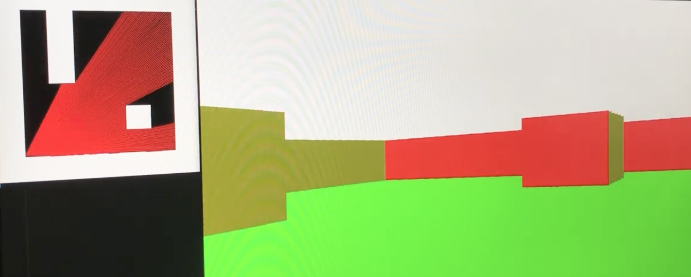

# cub3D - 42 Coding School Project
A simple raycasting engine in C, inspired by the classic Wolfenstein 3D, written by my colleague Josef Koupy and me.

## Overview  
It renders a first-person view of a 2D map using a raycasting algorithm and MiniLibX.



## Features  
✅ Real-time rendering with raycasting  
✅ Textured walls (N/S/E/W)  
✅ Keyboard movement (WASD) & camera rotation  
✅ Basic sprite display  
✅ Custom map parsing (.cub format)

## Technologies  
- C (C99)  
- MiniLibX  
- Math library (-lm)  
- Custom parsing logic  

## Build & Run  
```bash
make
./cub3D maps/level.cub
